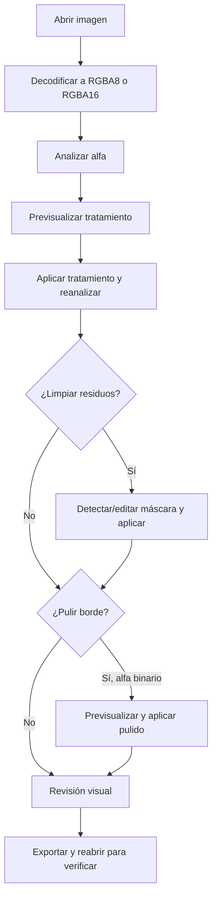

# Pipeline de procesamiento

## Flujo individual

## Etapas reales

### 1. Importación

- Entrada: bytes PNG/JPEG/WebP/TIFF/BMP, máximo 512 MB para archivos leídos desde ruta.
- Salida: `ImageDocument` con `original`, `working`, revisión 0 y profundidad RGBA de 8 o 16 bits.
- Responsables: `ImageDocument::decode`, `upload_document_bytes`, `read_dropped_image`.

### 2. Análisis alfa

- Cuenta alfa 0, alfa máximo y todos los valores intermedios.
- Agrupa píxeles parciales conectados por vecindad de 8.
- Produce histograma, regiones, porcentaje, recomendación y `verifiedSolidAlpha`.
- Responsables: `analyze_with_progress`, `connected_regions_with_progress`, `build_recommendation`.

### 3. Tratamiento

- La interfaz usa `threshold`; el motor también admite `make_transparent` y `make_opaque`.
- Menor al umbral pasa a transparente; igual o mayor pasa a opaco.
- Las protecciones pueden conservar textura conectada, líneas finas, grunge o regiones elegidas.
- La reconstrucción toma RGB de un interior opaco cercano sólo si la diferencia cromática es confiable.
- Después de aplicar se reanaliza; si no quedan pendientes y aparece alfa parcial, la operación falla.

### 4. Limpieza de residuos

- Detecta componentes aislados, restos exteriores y conexiones débiles según opciones.
- La selección es una máscara; no cambia la imagen hasta **Aplicar**.
- Aplicar pone alfa 0 en la selección, registra delta, reanaliza y limpia la máscara.

### 5. Pulido de borde

- Rechaza alfa no binario.
- Genera una máscara objetivo con suavizado morfológico, filtro de mayoría o redondeo de picos.
- Puede proteger detalle fino y textura conectada.
- Los píxeles que se vuelven opacos reconstruyen RGB mediante fuentes opacas cercanas ponderadas.
- Se reanaliza y se exige que siga siendo binario.

### 6. Exportación

- Analiza antes de exportar.
- Codifica y escribe.
- Reabre, decodifica y comprueba dimensiones, profundidad y alfa sólido.
- Elimina el archivo si la verificación falla o si se cancela al escribir.

## Individual frente a lote

Ambos flujos reutilizan `alphaService`, `residueService`, `jobService` y los mismos motores Rust. El lote orquesta las etapas desde `BatchPanel.tsx`, con configuración propia y sin confirmación visual por imagen. No existe un algoritmo de lote alternativo.

