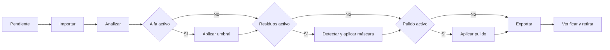

# Modo lote

## Entrada y cola

`scan_image_folder` recorre la carpeta y subcarpetas, ordena por ruta relativa y admite hasta 25.000 imágenes compatibles. Ignora archivos mayores de 512 MB. Las miniaturas se generan a un máximo de 112 × 80 px.

La cola visual está debajo del canvas y ocupa sólo la zona de imagen. Cada tarjeta muestra miniatura, nombre, etapa y progreso. Puede navegarse arrastrando horizontalmente o con flechas.

```mermaid
stateDiagram-v2
    [*] --> Pendiente
    Pendiente --> Procesando: siguiente imagen
    Procesando --> [*]: exportación correcta; se retira
    Procesando --> Error: falla de etapa o exportación
    Error --> Pendiente: reintentar
    Procesando --> Pendiente: detener; conserva cola
```

## Configuración predeterminada

- Transparencias: SÍ; umbral 50 %, reconstrucción automática, radio mostrado 2, protecciones de textura, líneas y grunge activas.
- Residuos: NO; partículas/restos/conexiones activables con tamaño 900, distancia 48, grosor 2 y sensibilidad 55.
- Pulido: NO; suave, radio 1, suavizado binario, protecciones activas.
- Formato: PNG, 300 PPP.
- Salida: carpeta de cada original si no se elige otra.

El porcentaje de umbral se convierte al rango real: 1..254 para 8 bits o 1..65534 para 16 bits.

## Secuencia

Si Transparencias está desactivado y una etapa posterior requiere alfa binario, la imagen queda en error. Si la detección de residuos no encuentra selección, el lote continúa sin aplicar esa etapa.

## Salida y nombres

El nombre propuesto es `<base>_dtf.<extensión>`. Si ya existe, el backend elige un sufijo disponible; nunca sobrescribe en lote. Al elegir una única carpeta de salida se aplana la estructura de subcarpetas, por lo que nombres repetidos reciben sufijos.

## Detener y errores

**Detener lote** cancela el trabajo activo y detiene la iteración. No es una pausa reanudable. Los pendientes permanecen; los errores permanecen con su mensaje y pueden reintentarse. Los éxitos desaparecen.

[CAPTURA PENDIENTE: cola con una tarjeta procesando, otra pendiente y una tarjeta en error]
