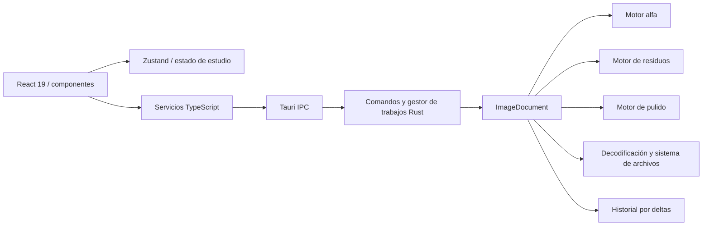

# Arquitectura

## Vista general

## Capas

- Presentación: `src/components`, canvas y CSS.
- Estado de interfaz: `src/stores/studioStore.ts`; configuración local de inspector en `localStorage`.
- Adaptadores: `src/lib/*Service.ts`; serializan tipos camelCase e invocan comandos Tauri.
- Aplicación: `src-tauri/src/commands`, `application/jobs.rs`, revisiones y permisos.
- Dominio: motores alfa, residuos y pulido; `ImageDocument` coordina mutaciones e historial.
- Infraestructura: crate `image`, crate `png`, filesystem, Tauri dialog/process/updater.

## Concurrencia

Las operaciones pesadas se lanzan con `tauri::async_runtime::spawn_blocking`. La interfaz inicia un trabajo y consulta su estado aproximadamente cada 90 ms. El lote es intencionalmente secuencial.

## Bus de comandos y MCP

`ApplicationCommandBus` implementa protocolo 1 para seis comandos internos. La UI sólo usa este bus de forma general para capacidades; el pipeline principal llama comandos de trabajo específicos. No hay binario, endpoint, transporte o manifiesto MCP en el repositorio.
