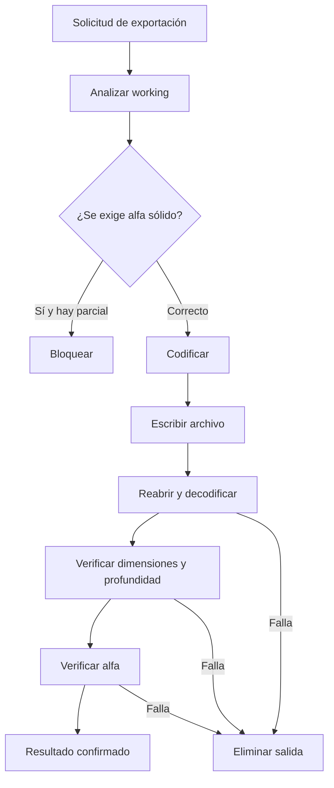

# Formatos y exportación

## Matriz verificada

| Formato | Abrir individual | Detectar en lote | Exportar individual visible | Exportar en lote | Profundidad de salida |
|---|---:|---:|---:|---:|---|
| PNG | Sí | Sí | Sí | Sí | 8 o 16 bits |
| JPG/JPEG | Sí | Sí | No | No | — |
| WebP | Sí | Sí | No | Sí, sin pérdida | 8 bits |
| TIFF/TIF | Sí | Sí | No | Sí | 8 o 16 bits |
| BMP | Sí | Sí | No | Sí | 8 bits |

La importación normaliza a RGBA. La compatibilidad real depende de los decodificadores del crate Rust `image` habilitados en `Cargo.toml`.

## Recorrido de exportación

PNG incluye densidad de píxeles calculada desde PPP (1..2400) y perfil sRGB perceptual. En otros formatos el valor PPP aparece en el resultado del trabajo, pero la implementación no lo incrusta explícitamente.

En lote, `avoidOverwrite=true` busca `<base>_dtf.ext`, luego un nombre con sufijo disponible. Una carpeta de salida común aplana las subcarpetas.
